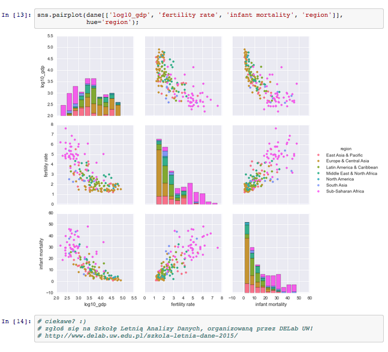

DELab UW - szkoła letnia analizy danych 2015
============================================

Repozytorium zawiera materiały użyte w [Szkole Letniej Analizy Danych 2015](http://www.delab.uw.edu.pl/szkola-letnia-dane-2015/), organizowanej przez [DELab UW](http://www.delab.uw.edu.pl).

Były to intensywne, 5-dniowe warsztaty skoncentrowane na eksploracyjnej analizie i wizualizacji danych dla przedstawicieli nauk społecznych i pokrewnych. Zajęcia odbywały się w dniach 30 czerwca – 4 lipca 2015 roku, w godzinach 9:00 – 17:00.

Materiały zostały przygotowane dla DELab UW przez [Piotra Migdała](http://migdal.wikidot.com/) i Juliana Zubka; kierownikiem organizacyjnym był Łukasz Jonak.

## Licencja

TODO

## Dlaczego?

Tradycyjne narzędzia przetwarzania i analiz danych – graficzne arkusze kalkulacyjne i pakiety statystyczne – nie zawsze dają sobie radę ze wszystkimi wyzwaniami stającymi przed badaczami. Nie chodzi tu tylko o wolumen danych, ale także o ich wielowymiarowość, zapewnienie powtarzalności procesu analiz, potrzebę generowania dużej liczby wysokiej jakości wizualizacji.

## Program ramowy

Materiały są dostępne w folderze [zajecia/](https://github.com/DELabUW/szkola-letnia-2015/tree/master/zajecia) w postaci notatników IPython Notebook. Można je oglądać w przeglądarce, by móc z nimi interagować, najlepiej [ściągnąć całe repozytorium](https://github.com/DELabUW/szkola-letnia-2015/archive/master.zip).

* Dzień 1
   * [podstawy Pythona, użycie IPython Notebook](zajecia/dzien1_czesc1_czym_jest_programowanie.ipynb)
   * [podstawy analizy danych w Pandas, proste wizualizacje](zajecia/dzien1_czesc2_wykresy_start.ipynb)
   * [abecadło programistyczne, Python jako język programowania](zajecia/dzien1_czesc3_jezyk_programowania.ipynb)

* Dzień 2
   * [sterowanie skryptem, standardowe kolekcje](zajecia/dzien2_czesc1_sterowanie_i_kolekcje.ipynb)
   * [zabawa słownikiem języka polskiego](zajecia/dzien2_czesc2_wyrazy.ipynb)

* Dzień 3
   * Pandas czyli tabele w Pythonie
      * [anatomia DataFrame](zajecia/dzien3_czesc1_anatomia_data_frame.ipynb)
      * [przetwarzanie danych](zajecia/dzien3_czesc2_podstawowe_przetwarzanie_danych.ipynb)
      * [wczytywanie danych](zajecia/dzien3_czesc3_wczytywanie_danych.ipynb)
      * [sklejanie danych](zajecia/dzien3_czesc4_sklejanie_danych.ipynb)
   * [analiza i wizualizacja szeregów czasowych](zajecia/dzien3_czesc5_szeregi_czasowe.ipynb)
   * deser: [sztuka robienia wykresów](zajecia/deser_sztuka_robienia_wykresow.ipynb)
   * deser: [interakcja z R (w tym ggplot)](zajecia/deser_r_ggplot.ipynb)

* Dzień 4
   * [korzystanie z internetowych API, elementy geocodingu](zajecia/dzien4_czesc1_api_geolokalizacja.ipynb)
   * [eksploracja danych, zaawansowane wykresy](zajecia/dzien4_czesc2_eksploracja_i_wykresy.ipynb)
   * [wstęp do modelowania liniowego](zajecia/dzien4_czesc3_regresja.ipynb)
   * deser: [przetwarzanie języka naturalnego](zajecia/deser_nlp.ipynb)

* Dzień 5
   * [projekty uczestników](zajecia/dzien5_projekty.ipynb)
   * [linki i inne materiały](zajecia/materialy.ipynb)
